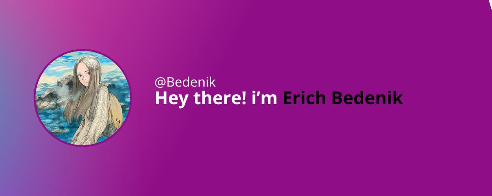

[]

I ❤️ solve great challenges using tech.    From backend development using Spring to frontend development using ReactJS, I am <strong>passionate to discover new stuffs</strong> and use them to create high quality solutions. Today, I'm a <strong>full stack developer</strong> focused on web and mobile development.
&nbsp;

 

 
 &nbsp;
 &nbsp;

## My Skills

&nbsp;
&nbsp;
&nbsp;
&nbsp;
&nbsp;
&nbsp;

#### Studying in this moment:

&nbsp;
&nbsp;
&nbsp;

#### Databases:
&nbsp;
&nbsp;

#### Workstation Tools:

&nbsp;
&nbsp;
&nbsp;
&nbsp;
	
#### Another knowledges
&nbsp;
&nbsp;

 
&nbsp;
&nbsp;

## Contacts:

 
 

 
 
  

&nbsp;&nbsp;

<h2>Thanks for the visit!</h2>

 

  
  

